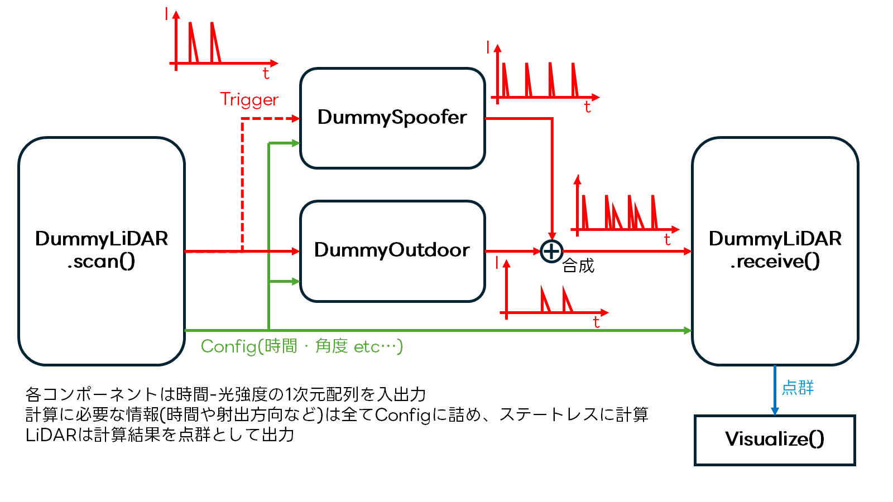

# SPAAL v2

* Simulator of the Physical Attack Against LiDARsの略
* Spoofing AttackとLiDARのToF信号処理をシミュレーションします

# 仕組み

* ToF距離計算に用いられる光を時間-強度の1次元データとしてモデル化
* LiDARの測距ごとに反射波形とその時間の攻撃波形をシミュレート、合成波形からToFを計算

# リポジトリ

- spaal2-core ([Keio-CSG/spaal2-core](https://github.com/Keio-CSG/spaal2-core))
  - シミュレータのコア部分。LiDARやSpooferの実装が含まれる。
- spaal2-template ([Keio-CSG/spaal2-template](https://github.com/Keio-CSG/spaal2-template))
  - シミュレータ利用のワークスペースを作るためのテンプレート。submodule経由でcoreをimportする。
- fastlyzer ([organic-nailer/fastlyzer](https://github.com/organic-nailer/fastlyzer))
  - シミュレーション実験の補助ライブラリ。複数パラメータを変えながら並列でシミュレーションを回すことができる。
- simple_pcd_viewer ([organic-nailer/simple_pcd_viewer](https://github.com/organic-nailer/simple_pcd_viewer))
  - 点群表示用のOpen3Dのラッパーライブラリ。

# どうやって使う？

やりたいこと別に紹介

- シミュレーションを動かしたい
  - →[spaal2-template](https://github.com/Keio-CSG/spaal2-template)をcloneするか、templateから新たなリポジトリを作って動かす
- シミュレータを開発したい
  - →[spaal2-core](https://github.com/Keio-CSG/spaal2-core)をcloneして頑張る

# Getting Started

1. [uv](https://docs.astral.sh/uv/)をインストール
2. `git clone git@github.com:Keio-CSG/spaal2-core.git`
3. `uv run example/ahfr.py`
